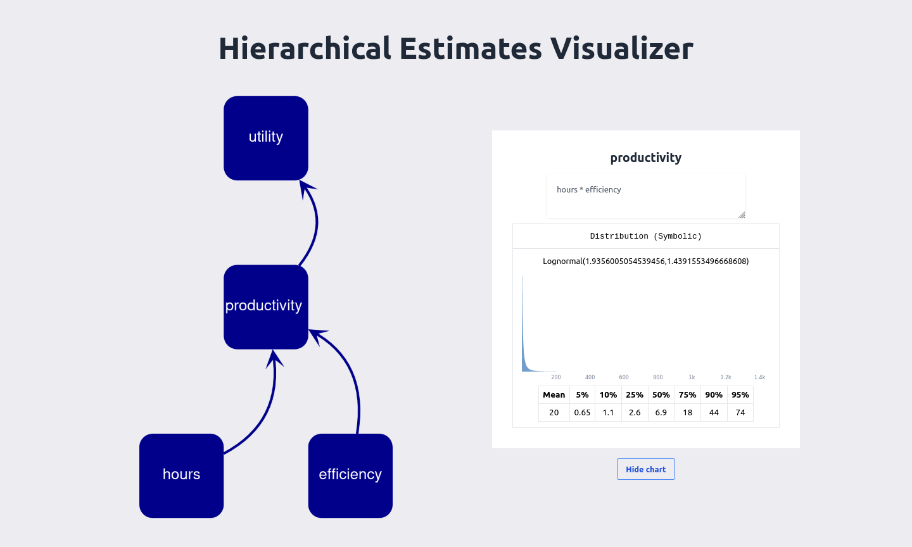

## About

This repository displays hierarchical estimates. It presents the user with a tree with nodes which can be clicked on and inspected, which visualizes the underlying squiggle calculation.

  

So far, this mostly has visualization capabilities, meaning that edits are impermanent.

**If you want to use the utility function extractor for a project, we are happy to add a page for your project, like `hierarchical-visualization.quantifieduncertainty.org/your-project`**.

## Built with

- [Nextjs](https://nextjs.org/)
- [Netlify](https://github.com/netlify/netlify-plugin-nextjs/#readme)
- [React](https://reactjs.org/)
- [Squiggle](https://www.squiggle-language.com/)

## Usage

Navigate to [hierarchical-visualization.quantifieduncertainty.org/](https://utility-function-extractor.quantifieduncertainty.org/) (to do: point to subdomain), and start visualizing.

## Contributions and help

We welcome PR requests.

## License

Distributed under the MIT License. See LICENSE.txt for more information.

## To do

- [ ] Allow for edits.